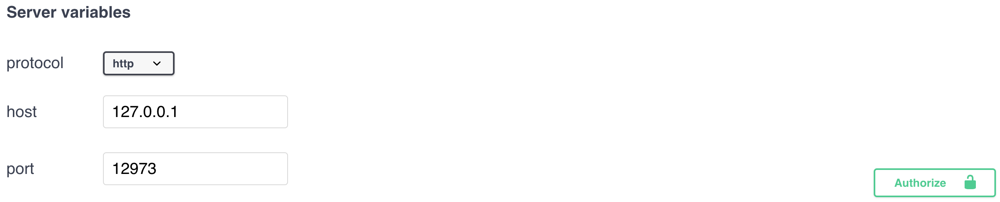
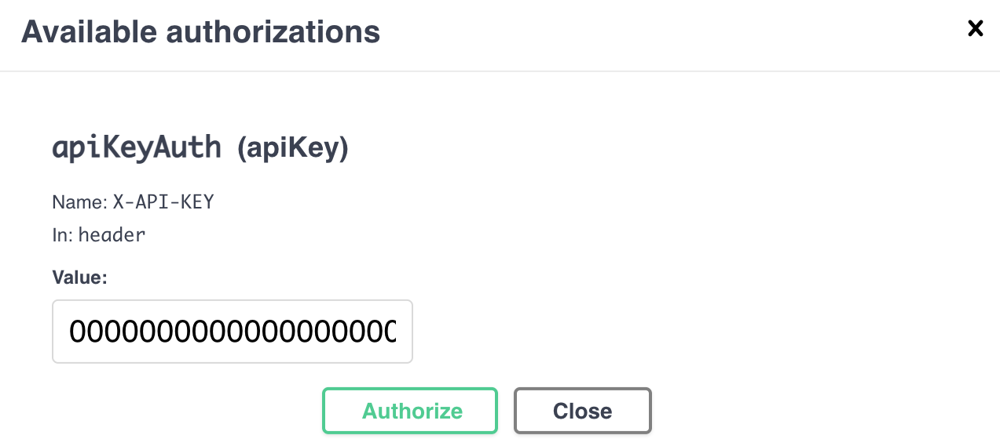

## API Key

Bạn nên thực hành sử dụng API key để giới hạn quyền truy cập vào các endpoint của full node.

### Cài đặt API Key

Hãy thêm đoạn mã sau vào `user.conf` và thay thế con số bên dưới bằng key của bạn (>= 32 characters).

```
alephium.api.api-key = "--- your own key with >= 32 characters"
```

Khởi động lại full node để có hiệu lực.

#### Tạo API Key

Trên GNU/ Linux: `cat /dev/urandom | tr -dc 'a-zA-Z0-9' | fold -w 48 | head -n 1`

### Sử dụng API Key

1. Nhấn vào nút `Authorize` ở góc trên bên trái của giao diện Swagger:
   

2. Điền key của bạn vào ô Value và nhấn nút Authorize:
   

Bây giờ bạn có thể sử dụng giao diện Swagger như thể không  có API key nào cả.

## Làm thế nào để truy cập full node API publicly?

1. Cài đặt API key một cách chính xác bằng hướng dẫn bên trên.

2. Thêm đoạn mã dưới đây vào `user.conf` và khởi động lại full node.

```
alephium.api.network-interface = "0.0.0.0"
```

## Làm sao để truy cập vào Swagger UI của full node trên máy tính khác dù khác subnet?

1. Thêm đoạn mã sau vào `user.conf` và khởi động lại full node.

```
alephium.api.network-interface = "0.0.0.0"
```

2. Thay đổi `host` của Swagger UI để nó trở thành subnet IP cho full node của bạn.

## Lỗi "java.lang.AssertionError: assumption failed"

Lỗi này thường xãy ra bởi vì mất kết nối trong khi quá trình đồng bộ node đang diễn ra và nó có nghĩa là một vài tệp tin có thể đã bị gián đoạn. Để giải quyết vấn đề này:

1. Xóa thư mục .alephium bằng `rm .alephium`

2. Khởi động lại node và đợi quá trình đồng bộ hóa `java -jar alephium-x.x.x.jar` hoàn thành.

## Di chuyển dữ liệu trong thư mục Alephium

Có rất nhiều người thích giữ data của thử mục Alephium trong một ổ cứng khác hơn là primary boot disk. Để làm điều tương tự với dữ liệu Alephium full node, bạn có thể sử dụng biến `ALEPHIUM_HOME`:

1. Dừng việc sử dụng Alephium full node jar
2. Di chuyển dữ liệu thưc mục của Alephium (thông thường nó sẽ ở `%userprofile%\.alephium` trên Windows hoặc `~/.alephium` trên Linux và macOS) đến một vị trí mới
3. Thêm một environment variable `ALEPHIUM_HOME` vào sau một nơi mới. Bạn có thể không cần làm điều này ở system level hoặc đơn giản là tạo một tệp batch chứa biến trước để chạy Alephium jar.
4. Khởi động lại Alephium node

Nếu bạn sử dụng docker full node, chỉ đơn giản là thay đổi tùy chỉnh thư mục cần được mount ở trong tệp docker để trỏ vào trong một thư mục mới và sau đó khởi động lại.

## Tùy chỉnh Logging

Có rất nhiều các environment variable được sử dụng cho logging:

- `ALEPHIUM_LOG_LEVEL` có thể thay đổi console log level.
- `ALEPHIUM_ENABLE_DEBUG_LOGGING` có thể kích hoạt debug logging.
- `ALEPHIUM_HOME` có thể thay đổi home folder của full node, và cả thư mục chứa các log

Bên dưới là ví dụ với tất cả các tùy chọn log khả dụng:

```
ALEPHIUM_HOM=<folder> ALEPHIUM_LOG_LEVEL=<DEBUG | INFO | WARN | ERROR> ALEPHIUM_ENABLE_DEBUG_LOGGING=<true | false> java -jar alephium-x.x.x.jar
```

Nó cũng có thể được ghi đè lên [logging configuration file](https://github.com/alephium/alephium/blob/master/flow/src/main/resources/logback.xml) của Alephium.

```
java -Dlogback.configurationFile=/path/to/config.xml alephium-x.x.x.jar
```
