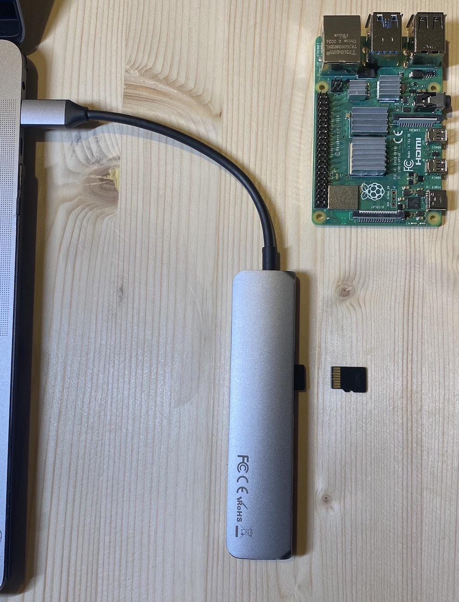

Trong hướng dẫn này, bạn sẽ tìm hiểu về:

- Cài đặt một Raspberry Pi 4
- Cách chạy full node docker'ized trên Alephium 

## Hướng dẫn cài đặt Raspberry Pi 4

Phần đầu tiên này chúng tôi hướng dẫn cho bạn cách cài đặt Ubuntu 20.04 server trên một Raspberry Pi 4.
Yêu cần cần một chiếc Raspberry Pi 4, một SD Card (tối thiểu 8 GB) và một đầu đọc thẻ nhớ (SD Card reader) để đọc SD card. Chúng tôi sử dụng shell command trên MacOS nhưng  bạn có thể thực hiện nó tương tự trên Windows.



Đầu tiên, chúng ta cần phải tùy chỉnh cài đặt Ubuntu bằng  cloud-init vì nó có sẳn trên Ubuntu 20.04 hoặc cao hơn.
Tùy chỉnh này sẽ tạo một user (khác với user mặc định của `ubuntu`) và sẽ cài một vài package.

### Cài đặt boot

Cho đoạn code bên dưới vào trong tệp tên là `user-data.yml` và lưu nó lại. Nó sẽ tạo một user tên là `alephium` với mật khẩu là `installfest2021`.
Bạn có thể tùy chỉnh lại theo ý muốn nếu bạn hiểu về nó.

```yaml
#cloud-config

hostname: alephium

ssh_pwauth: true

users:
  - name: alephium
    gecos: "alephium"
    sudo: ALL=(ALL) NOPASSWD:ALL
    shell: /bin/bash
    groups: adm,sudo,docker
    plain_text_passwd: installfest2021
    lock_passwd: false
    chpasswd: { expire: false }
#    ssh_authorized_keys: # Optionally ad ssh key here, if you don't want the password.
#      - ssh-ed25519 xxxxxxxxxxxxxxxxxx

packages:
  - apt-transport-https
  - ca-certificates
  - curl
  - gnupg-agent
  - software-properties-common
  - git
  - openssh-server
  - docker.io
  - docker-compose

runcmd:
  - systemctl start docker
  - systemctl enable docker

package_update: true
package_upgrade: true

power_state:
  mode: reboot
```

### Ghi vào SD Card

Bây giờ, chúng ta sẽ ghi dữ liệu vào SD Card có chứ tệp này `user-data.yml`.

Chúng tôi sử dụng tool [flash](https://github.com/hypriot/flash/) để ghi, nó sẽ giúp bạn trong phần khó nhằn này.

```shell
curl -LO https://github.com/hypriot/flash/releases/download/2.7.2/flash
chmod +x flash

./flash --userdata user-data.yml https://cdimage.ubuntu.com/releases/20.04/release/ubuntu-20.04.4-preinstalled-server-arm64+raspi.img.xz
```

Câu lệnh bên trên sẽ yêu cầu xác thự rằng `/dev/disk2` là một SD card chứ không phải ổ cứng của bạn và bạn sẽ phải gõ mật khẩu vào bởi vì ghi dữ liệu vào SD card sẽ cần quyền admin.

Một khi câu lệnh được hoàn thành, bạn có thể gắn SD card vào trong Raspberry Pi và bật nó lênh.
Sẽ mất một chút thời gian cho lần boot đầu tiên.
Khi node đã sẳn sàn, bạn có thể ssh vào nó với username là `alephium` và `installfest2021` và mật khẩu!

```shell
ssh alephium@alephium
```

Nếu `alephium` host thông báo unknown, bạn sẽ phải tìm địa chỉ IP của node. Hầu hết nó sẽ nằm trong phần cài đặt trong trang router.

Giờ đây, Raspberry Pi của bạn đang chạy Ubuntu 20.04 với Docker và nó đã sẳn sàn để chạy Alephium full node.

🚀


## Cách chạy full node với docker'ized của Alephium 

Phần hướng dẫn thứ hai này sẽ không chi tiết hướng dẫn dùng Raspberry Pi, nhưng bạn có thể truy cập vào trong bất kỳ server/vm/máy tính nào với SSH. Chúng ta sẽ chạy phiên bản cơ bản nhất của full node trên Alephium, sau đó lặp lại quá trình này để thuận tiện sử dụng nó hơn.

Có một điều bắt buộc ở quá trình này là bạn phải có quyền  truy cập SSH vào server và phiên bản Ubuntu phải là 20.04 trở lên. Ở phần hướng dẫn bên trên, chúng tôi đã giải thích về nó, nhưng một AWS EC2 cũng có thể chạy được nếu bạn muốn thử.

### Kết nối vào server

Rất đơn giản, bạn chỉ việc dùng câu lệnh `ssh`. Gõ:

```shell
ssh alephium@alephium
```

### Cài đặt docker và docker-compose

Hãy cài đặt nhanh docker và docker-compose. Nó là bộ đôi để chạy full node trên Alephium.

Một khi đã ssh vào, chạy câu lệnh bên dưới:

```shell
sudo apt install -y docker.io docker-compose
```

Tuyệt vời, docker đã sẳn sàn:

```shell
docker ps
```

### Khởi chạy full node

Bây giờ chúng ta có thể chạy full node, với một câu lệnh bên dưới:

```shell
docker run -it --rm -p 12973:12973 --name alephium alephium/alephium:latest
```

### Docker-compose

Docker-compose là một cách thuận tiện để chạy một container, đặc biệt là nếu câu lệnh khởi động và chứa các volume, nhiều port, environment variable, v.v.

Bây giờ, bạn có thể cho tệp `docker-compose.yml` vào trong service definition và đơn giản call `docker-compose up -d` để chạy full node của bạn từ definition này.

```yaml
version: "3"
services:
  broker:
    image: "alephium/alephium:latest"
    restart: unless-stopped
    ports:
      - 9973:9973/tcp
      - 9973:9973/udp
      - 10973:10973/tcp
      - 12973:12973/tcp
```
