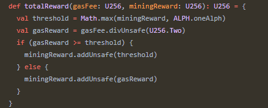
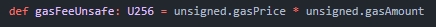

Đây là danh sách tổng hợp các khái niệm, thuật ngữ có thể hữu ích cho việc tìm hiểu về Blockchain nói chung và Alephium nói riêng.

## A

### Alephium

Alephium là blockchain L1 đầu tiên giúp mở rộng và nâng tầm các khái niệm PoW & UTXO. 
Ngoài các tính năng phi tập trung, tự chủ, bảo mật cao, dễ tiếp cận và tiết kiệm năng lượng, Alephium còn là một network thân thiện với lập trình viên, được tối ưu hoá cho các ứng dụng DeFi và hợp đồng thông minh (smart contract). 

Từ thiết kế kỹ thuật đến giao diện, Alephium đã được tạo ra để khắc phục các vấn đề về khả năng truy cập, khả năng mở rộng và bảo mật mà các ứng dụng phi tập trung hiện nay đang gặp phải. 

## B

### Thuật toán Blake 3 (Hash Function)
[Thuật toán Blake 3](https://github.com/BLAKE3-team/BLAKE3) là một hash function được mã hoá. Một hash function là một hàm toán học lấy chuỗi đầu vào có độ dài bất kỳ và chuyển đổi nó thành chuỗi đầu ra có độ dài cố định. Chuỗi đầu ra có độ dài cố định đó được gọi là hash value. 

Hash functions được sử dụng trong nhiều trường hợp trên một blockchain: trong [Merkle Tree](#merkle-tree), Proof of Work Consensus, digital signature, và trên chính Blockchain (vì mỗi block header của một block trong blockchain chứa hash của block header trước đó). Ví dụ như Bitcoin sử dụng [SHA-256.](https://en.wikipedia.org/wiki/SHA-2)

Alephium sử dụng thuật toán Blake 3 như là hash function được mã hoá cho công việc đào.

### Block Reward

Block reward là phần thưởng có giá trị kinh tế nhằm tạo động lực cho người đào tiếp tục công việc bảo vệ network. 

Người đào sẽ được trả bằng token của blockchain đó. Phần thưởng này thường sẽ nhiều hơn khi network còn nhỏ và mới, khi network đã phát triển thì phần thưởng sẽ ít lại. 
[Block Reward của Alephium trên GitHub](https://github.com/alephium/alephium/blob/master/protocol/src/main/scala/org/alephium/protocol/mining/Emission.scala)

### Block Size

Block size là giới hạn dữ liệu mà mỗi block có thể xử lý. 

Nó có thể được ước tính bằng nhiều cách. Trong một số blockchain, nó được biểu thị bằng lượng dữ liệu thực tế mà một block có thể chứa (ví dụ ở Zcash, block size là 2MB). Ở các blockchain khác, block size là giới hạn xử lý của máy tính mà nó có thể chiếm từ network (thường được biểu thị bằng gas). Block size của Etherium và Alephium được tính theo cách này. 

### Block Time

Block Time là thời gian cần thiết để tính toán các giao dịch trong một block và gửi nó lên network. 

Các giao dịch được tập hợp trong một block và được kiểm tra bởi các máy đào (hoặc các validators trên PoS blockchains). Thông thường block time bị ảnh hưởng bởi độ khó của việc đào, vì nó được điều chỉnh để phản ánh khả năng tính toán của network (hashrate) trong khoảng thời gian nhât định. 

Alephium network có sự điều chỉnh độ khó trên mỗi block và có block time được ước tính là **64 giây**. 

Tài liệu đọc thêm: [Block Time and Block Size Article](https://medium.com/@alephium/block-time-and-block-size-16e37292444f)

### Bridge

Bridge là một giao thức kết nối các blockchain riêng biệt để tạo ra sự tương tác giữa chúng. Mỗi blockchain thường có các tính năng công nghệ riêng, nhưng lại không có cách riêng để liên lạc với những giao thức khác. Vì thế bridge là một tập hợp các smart contract để liên kết các hệ sinh thái khác nhau này. 
 
Bridge có thể được chuyên biệt hơn bằng cách chỉ cho phép một loại tương tác (chằng hạn như di chuyển token), hoặc khái quát hơn khi cho phép bất kỳ loại truyền dữ liệu nào giữa các blockchain đã được bridged với nhau. 

## C

## D

## E

## F

## G

### Gas spent 

Gas Spent là số lượng tính toán mà máy đào dùng để thực hiện các giao dịch. Giao dịch nào càng có nhiều chức năng thì việc thực hiện nó càng phức tạp và càng tốn nhiều gas. 

Hiện tại, như một biện pháp anti-spam thì giá trị tối thiểu cho bất kỳ giao dịch nào trên Alephium là 20'000 gas, nghĩa là phí giao dịch của bạn có giá ít nhât là 0,002 ALPH. 

Khi network đã phát triển thì điều này sẽ được nới lỏng và thị trường sẽ xác định phí giao dịch. 

### Gas Price

Đây là giá trị tiền tệ của gas. Gas được định nghĩa là nỗ lực tính toán để thực thi một lệnh trong blockchain. Phí gas là tiền để trả cho công việc được thực hiện bởi người đào. 

### Genesis Block

Genesis Block là tên của block đầu tiên được đào trong một blockchain. Khi các block xếp chồng lên nhau thì Genesis Block là nền tảng hoặc là nơi bắt đầu của chúng. 

Đôi khi nó còn được gọi là Block 0 hay Block 1. Khi một block mới được thêm vào blockchain thi nó sẽ tham chiếu đến các block trước đó. Nhưng vì không có block nào ở trước, nên Genesis Block thường được hardcode vào phần mềm. 

Genesis Block của Alephium được đào vào ngày 8/11/2021. 

## H

### Hard Fork

Hard fork xảy ra khi có một nâng cấp lớn trên network's protocol làm cho các nodes hay người dùng sử dụng phiên bản cũ không thể gửi hoặc xác thực các giao dịch sau đó. 

Bởi việc nâng cấp là tuỳ chọn, nên đôi khi một số nodes hay người dùng quyết định không thực hiện, vì thế sẽ tạo ra một phiên bản blockchain khác từ đó, và điều này đã xảy ra với Ethereum và Ethereum Classic. 

## I

## J

## K

## L

## M

### Merkle Tree

Merkle tree [là một dạng cấu trúc](https://en.wikipedia.org/wiki/Merkle_tree) được sử dụng để nén dữ liệu một cách hiệu quả và an toàn hơn.

Khi blockchain gom các giao dịch vào các blocks thì mỗi block có một header, và header này có một hash; Hash này được lưu trữ trên Merkle Tree. Hash từ Merkle Tree đuợc dùng để xác minh rằng tệp dữ liệu giống với tập hợp giao dịch ban đầu mà không cần truy cập vào nội dung bên trong block. Khi hình dung, cấu trúc này giống một cái cây và có thể được gọi là một "binary hash tree". 

Ví dụ, Alephium sử dụng ba Merkle trees cho mỗi nhóm để lưu trữ tài sản - UTXOs, contract logic và contract state. 

### Maximal Extractble Value (MEV)

Người đào hay [Maximal Extractable Value (MEV)](https://ethereum.org/en/developers/docs/mev/) là giá trị thu được từ việc đào một block mà vượt quá tiêu chuẩn block reward và phí gas bằng cách thay đổi, bao gồm hoặc loại bỏ các giao dịch trong một block. 

Sự khác biệt này được đưa ra bởi các tác nhân được gọi là "searchers" nhằm phân tích nhóm tìm kiếm cơ hội lợi nhuận bằng cách thay thế thông tin trên một giao dịch, chẳng hạn như địa chỉ người gửi và người nhận. Để tăng xác suất giao dịch của họ được máy đào chọn trở thành một phần trong block tiếp theo được tạo ra, họ sẵn sàng trả phí gas cao hơn nhiều so với mức trung bình.

### Mining Reward

Mining reward là phần thưởng cho người đào cho việc tính toán cần thiết để xác thực các giao dịch và gom chúng vào một block. Trên Alephium, Mining reward có hai phần: [Phí giao dịch](#transaction-fee) và [Block Reward](#block-reward) hoặc new token emissions. Giao dịch trao thưởng cho người đào và phát hành đồng ALPH mới được đào, được gọi là một coinbase transaction. 

Công thức tính Mining reward:

Tổng Mining Reward = = Block Reward + min(max(Block Reward, 1 ALPH), transaction fees / 2)

Như một cơ chế giảm phát thì phân nửa phí giao dịch (transaction fees) sẽ được đốt. 

Tài liệu ọc thêm: [Alephium Block Rewards](https://medium.com/@alephium/alephium-block-rewards-72d9fb9fde33)

### Multisig

Multisig hoặc Multisignature là quá trình yêu cầu hơn một private key để đồng ký tên một giao dịch để nó được đưa lên network. Đây chỉ là một bước bảo mật bổ sung. 

Thông thường, việc thiết lập multisig sẽ yêu cầu số lượng người ký tối thiểu để một giao dịch được phê duyệt và gửi đi. Ví dụ, một multisig của 5 trên 9 người sẽ yêu cầu tối thiểu 5 người đồng ký tên giao dịch trước khi nó được gửi đi. 

[Ví Full Node](/wallet/node-wallet-guide) của Alephium hỗ trợ các địa chỉ ví có multisig. 

## N

## O

## P

### Proof of Less Work (hay PoLW)

Tương tự như Proof-of-Work của Bitcoin, hay Proof-of-Stake của Ethereum (sau khi được merge), PoLW là cơ chế đồng thuận của Alephium. Nó tối ưu hoá mức tiêu thụ năng lượng của mạng lưới mà không làm ảnh hưởng đến khả năng bảo mật hay tính phi tập trung. Nó được kích hoạt khi mạng lưới vượt quá 1 Eh/s tốc độ hashrate. 

Sau đó, nó tiêu thụ một phần phí để đào ra một block mới bằng cách đưa cơ chế coin-burning (đốt coin) vào trong quá trình xác thực block mới. Điều này mang lại lợi ích cho tổng cung lưu thông trong quá trình tạo ra các token. Trong cùng một điều kiện, Alephium chỉ sử dụng ⅛ năng lượng tiêu thụ so với việc khai thác Bitcoin.

Đọc thêm về PoLW: [TECH TALK #1 — The Ultimate guide to Proof-of-Less-Work, the universe and everything…](https://medium.com/@alephium/tech-talk-1-the-ultimate-guide-to-proof-of-less-work-the-universe-and-everything-ba70644ab301)

## Q

## R

## S

### Sharding 

Sharding là một cách quản lý database bằng cách chia database lớn thành các phần nhỏ hơn, nhanh hơn và dễ quản lý hơn. 

Những phần nhỏ hơn này được gọi là [“shards”](https://en.wikipedia.org/wiki/Shard_(database_architecture)), có nghĩa là "một phần nhỏ của tổng thể." Sharding được sử dụng khi máy tính không đủ khả năng để xử lý database, nó cần thiết khi kích thước của blockchain vượt quá khả năng xử lý của Virtual Machine và network. Sharding chia blockchain chính thành các phần riêng biệt, và các nodes chỉ xác minh một tập hợp con giao dịch, điều này cho phép xác minh giao dịch song song. Nhờ vậy mà thông lượng network sẽ tăng. 

Blockchain của Alephium được phân chia (sharded) và thuật toán Blockflow đang quản lý việc này. Hiện tại chúng tôi có bốn nhóm với bốn shards trong mỗi nhóm. 

### Smart Contract 

[Smart Contract (SC)](https://en.wikipedia.org/wiki/Smart_contract) là một chương trình máy tính cho phép các giao dịch được thực hiện bằng các quy tắc đã được xác định trước mà không cần dựa vào bên thứ ba, cơ quan trung ương hay cơ chế bên ngoài. Trong blockchain, một smart contract được viết bằng ngôn ngữ lập trình gốc hoặc được biên dịch sang và usually thường chạy trên [Virtual Machine.](#virtual-machine) của blockchain. 

Các SC trên blockchain có thể lưu trữ [state](#state) tuỳ ý và thực hiện các giao dịch tuỳ ý. Khách hàng đầu cuối cũng sử dụng các giao dịch để tương tác với SC. Và các giao dịch SC cũng có thể tham khảo từ các SC khác. Các giao dịch này có thể dẫn đến việc thay đổi state và gửi coins từ SC này sang SC khác hoặc từ tài khoản này sang tài khoản khác. 

Trong Alephium, các smart contracts được viết dưới ngôn ngữ Ralph và chạy trên Alphred Virtual Machine.

### State

State (trạng thái) là một [khái niệm khoa học máy tính](https://en.wikipedia.org/wiki/State_(computer_science)), trong đó máy tính có thể có nhiều states, nhưng chỉ có một state tại thời điểm bất kỳ. 

Một blockchain được xem là một máy tính có state. State miêu tả trạng thái hiện tại của hệ thống, và các giao dịch (nhận và gửi) kích hoạt sự chuyển đổi state. Vì các giao dịch được nhóm lại thành các blocks để làm cho quy trình hiệu quả hơn, nên việc bổ sung một block sẽ thay đổi state thưc tế của blockchain. 

Alephium sử dụng mô hình stateful UTXO để có một state đầy đủ tính năng hơn so với các mô hình UTXO khác. 

## T

### Time to Finality

Time to Finality là khoảng thời gian từ khi giao dịch được gửi lên network cho đến khi nó được xem là cuối cùng (và không thể thay đổi). Có hai dạng finality: finality xác suất và finality xác định.

Hầu hết các hệ thống blockchain đều cung cấp các giao dịch có finality xác suất — nghĩa là xác suất của một giao dịch hợp lệ và không thể thu hồi được sẽ tăng lên khi có nhiều block được thêm vào chain, nhưng nó sẽ không bao giờ hoàn toàn là cuối cùng. Network sẽ xác nhận giao dịch cuối cùng khi có đủ thời gian và blocks. Đây là cách Bitcoin đạt được finality, ví dụ: một giao dịch được xem là cuối cùng sau 6 blocks. 

Các blockchains sử dụng giao dịch có finality xác định (đôi khi được gọi là finality tuyệt đối) — nghĩa là giao dịch được xem là cuối cùng khi nó được thêm vào blockchain. Fantom là một ví dụ về điều này.

Tài liệu đọc thêm: [Bài viết về Time to Finality](https://medium.com/@alephium/time-to-finality-17d64eeffd25)

### Token

Một token là một registry entry trong blockchain that tuân theo bộ quy tắc đuợc mã hoá bởi smart contract. Định nghĩa này làm rõ sự khác biệt giữa token và tiền điện tử khi mà tiền điện tử là tài sản gốc của một blockchain như là BTC và ETH, còn tokens được built trên blockchain có sẵn và đang sử dụng smart contracts.

Tokens có thể được phân loại là fungible (có thể thay thế) hoặc non-fungible (không thể thay thế). Fungible tokens giống hệt nhau và có thể thay thế được cho nhau. Ngược lại, non-fungible tokens (NFTs) là độc nhất và được chứng minh là khan hiếm, nghĩa là lịch sử của chúng có thể được truy tìm độc lập.

Tokens cũng có thể được phân loại theo chức năng của chúng: tiện ích (utility), bảo mật (security) hoặc tiền tệ (currency). Currency tokens được tạo ra để giao dịch, như DAI hoặc USDC của MakerDAO. Utility tokens tập trung vào việc sử dụng thực tế, thể hiện quyền truy cập vào một sản phẩm hay dịch vụ nhất định. Security tokens là tượng trưng của một loại tài sản, ví dụ như cổ phiếu, quyền biểu quyết trong công ty, hay các tổ chức tập trung khác, hoặc một số vật phẩm hữu hình hay kỹ thuật số có giá trị. 

### Transaction Fee 

Khi một người thực hiện giao dịch trên Alephium, người đó phải trả phí cho những người đào để đưa giao dịch này vào một block. 

Transaction fee (Phí giao dịch) bao gồm 2 phần: [Gas Price](#gas-price) trong token gốc của network và [Gas Amount Spent](#gas-amount-spent) trong quá trình xử lý giao dịch, và có thể được xác định theo công thức sau:

Transaction fee = Gas Price * Gas Amount Spent

Tài liệu đọc thêm: [Áp dụng Transaction fee trên GitHub](https://github.com/alephium/alephium/blob/v1.4.2/protocol/src/main/scala/org/alephium/protocol/model/Transaction.scala#L230-L239)

### Transactions Per Second (TPS)

Transactions Per Second (TPS) - số lượng giao dịch trên mỗi giây là đơn vị đo số lượng giao dịch, trên lý thuyết có thể xảy ra trong một giây trong một hệ thống nhất định. 

Trong blockchain, nó còn được hiểu như tốc độ (tốc độ của một giao dịch có được gửi lên network) và được tính theo công thức sau:
 
TPS = (Block Size / Transaction Size ) /Block Time

Tài liệu đọc thêm:[Bài viết về Transactions Per Second](https://medium.com/@alephium/transactions-per-second-tps-f13217a49e39)

## U

### UTXO

[UTXO](https://en.wikipedia.org/wiki/Unspent_transaction_output) (Unspent Transaction Output) là một thuật ngữ đùng để chỉ số lượng tiền cụ thể vẫn chưa được dùng sau một phiên giao dịch tiền điện tử. 

Trên một blockchain có mô hình tài khoản UTXO, phần tiền được gửi đi và chưa được dùng trong một giao dịch sẽ được sử dụng như một phương thức kế toán. Giống như kế toán kép, mỗi giao dịch đều có đầu vào và đầu ra.

Các phiên bản cải tiến đã được xây dựng trên UTXO, như là eUTXO, Cell System, hoặc sUTXO của Alephium. 

## V

### Virtual Machine

A Virtual Machine (VM) là một phần mềm mô phỏng máy tính vật lý để chạy các chương trình và triển khai cái ứng dụng. 

Một virtual machine chạy hệ điều hành và chức năng riêng của nó. Mỗi node chạy một bản copy của VM để chạy các chương trình (smart contracts) và cho phép chúng tương tác với nhau và với chính blockchain. 

Virtual machine của Alephium là Alphred và nó có rất nhiều [điều thú vị.](https://www.youtube.com/watch?v=VVYH9rBJAdA&list=PLqL60kqgLPBBrc64K-1Gs771FBTiLtYZE&index=29)

## W

## X

## Y

## Z

