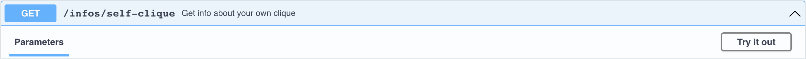
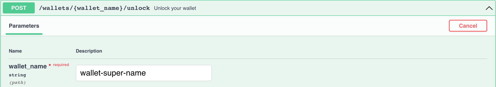
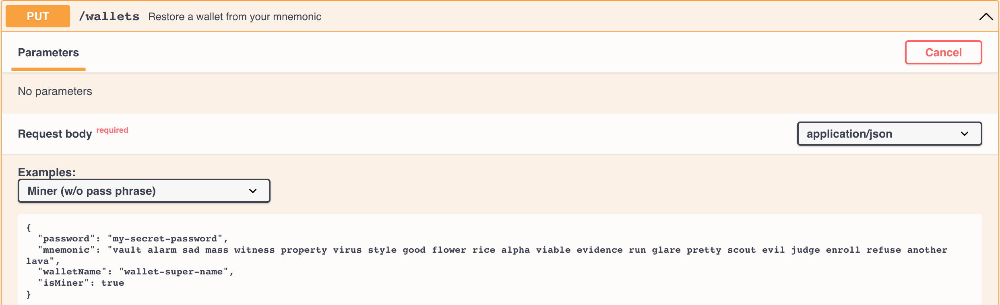

import UntranslatedPageText from "@site/src/components/UntranslatedPageText";

<UntranslatedPageText />

# Hướng dẫn đào Solo 

Đầu tiên bạn phải làm theo các bước ở [Hướng dẫn bắt đầu Full node](full-node/getting-started.md) để tải về, khởi động node của bạn và sử dụng Swagger [http://127.0.0.1:12973/docs](http://127.0.0.1:12973/docs).

## Thông tin về việc đào 

- có 4 nhóm địa chỉ và 16 chains tổng cộng
- dự tính block time là 64 giây
- mỗi ngày có trung bình `24 * 60 * 60 / 64 * 16 = 21600` blocks được đào
- block rewards đang là 3 ALPH ở thời điểm hiện tại 
- Tất cả các coins được đào sẽ bị khoá trong 500 phút 

Để biết thêm thông tin về mining rewards, hãy đọc [Block Rewards](https://medium.com/@alephium/alephium-block-rewards-72d9fb9fde33).

Bạn có thể biết được hashrate được ước tính từ nhật ký full node của bạn, hoặc từ bảng điều khiển Grafana của full node nếu bạn chạy nó bằng [docker-compose](full-node/docker-guide.md).

## Ví dành cho người đào 

Đầu tiên, bạn phải tạo một ví chuyên dụng cho việc đào. Trái ngược với _ví truyền thống_, một _ví dành cho người đào_ có nhiều địa chỉ được sử dụng để thu thập mining rewards cho mỗi nhóm địa chỉ.

#### Tạo ví cho người đào 

Server sẽ gửi bạn bản ghi nhớ ví mới, hãy sao lưu và lưu trữ nó an toàn. 

#### Ghi lại các địa chỉ ví dành-cho-người-đào của bạn 

Server sẽ gửi bạn 4 địa chỉ ví cho bước tiếp theo:

## Configure miner addresses

Hiện tại bạn đã có 4 địa chỉ ví dành-cho-người-đào, bạn phải gán chúng cho node của bạn để có được rewards khi nó bắt đầu đào. Việc này có thể được thực hiện bằng cách thêm vào nội dung sau đây `.alephium/user.conf` trong home folder của bạn [^1]:

    alephium.network.external-address = "x.x.x.x:9973" // put your public IP here; otherwise remove this line
    alephium.mining.miner-addresses = [
      "1HiYeRbypJQK4nc6EFYWiRVdsdYukQKq8SvKQsfJ3wiR8",
      "1HD3q1G7qVoeyNA4U6HbBhFvv1FLUWNGwNavPamScpVLa",
      "1CQiD2RQ58ymszcgPEszRomyMZxEjH1Rtp4tB84JY2qgL",
      "19vvD3QbfEYbJexk6yCtnDNpRrfr3xQv2Pzc6x265MRhD"
    ]

Vui lòng khởi động lại node của bạn để các cấu hình mới này có hiệu lực. Hãy đảm bảo rằng bạn thêm chúng vào theo đúng thứ tự mà they were returned by the endpoint, vì chúng được sắp xếp theo nhóm của chúng.

## Bảo mật

Theo mặc định, the API interface of Alephium is bound to localhost, your API endpoints are secure. However, if you configured `alephium.api.network-interface`, your endpoints might be exposed to public network. This can be dangerous as anyone would be able to access your miner wallet. Please consider to configure API Key following this guide: [API Key](full-node/full-node-more.md#api-key).

Please also consider to create another secure wallet and move your funds to that wallet using `sweep-all-addresses` endpoint regularly.

## Start mining

### Make sure your full node is synced

You could verify that by executing this endpoint:

If you see `"synced": true` in the response, then you are ready to go.

### Nvidia GPU

Please follow the instructions on [https://github.com/alephium/gpu-miner](https://github.com/alephium/gpu-miner#readme) to run the gpu miner for Nvidia GPUs.

Alternatively, you could run the gpu-miner with docker by following the documents here [https://github.com/alephium/alephium/tree/master/docker#gpu-miner-optional](https://github.com/alephium/alephium/tree/master/docker#gpu-miner-optional)

### AMD GPU

Please follow the instructions on [https://github.com/alephium/amd-miner](https://github.com/alephium/amd-miner#readme) to run the gpu miner for AMD GPUs. Note that the performance of AMD miner is not in par with Nvidia miner.

If you have any questions, feel free to reach out to the developers on [Discord](https://alephium.org/discord).

## More info on miner wallet

Here are more endpoints that are useful for miners.

#### Get your balance

#### Change your active address

#### Transfer all your funds on the active address to another address

#### Unlock your wallet

#### Restore your miner wallet

[^1]: The home folder depends on your system: `C:\Users\<your-username>` in Windows, `/Users/<your-username>` in macOS, `/home/<your-username>` in Linux.
