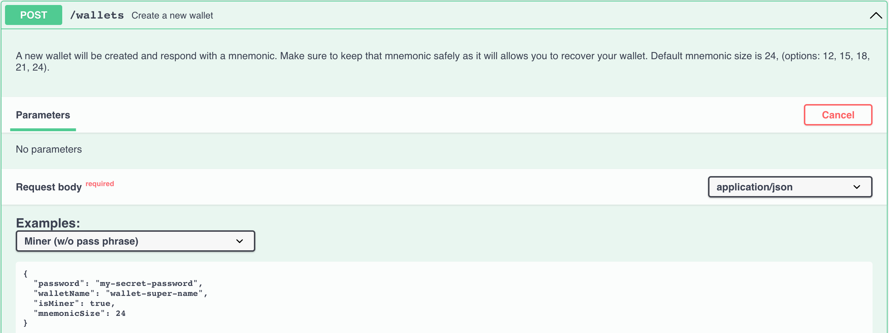
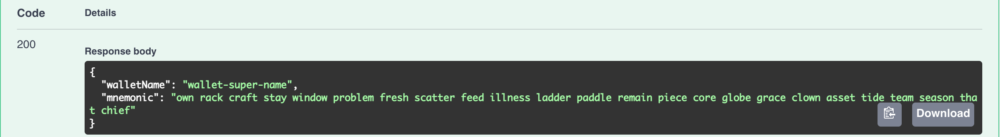

# Hướng dẫn đào Solo 

Đầu tiên bạn phải làm theo các bước ở [Hướng dẫn bắt đầu Full node](full-node/getting-started.md) để tải về, khởi động node của bạn và sử dụng Swagger [http://127.0.0.1:12973/docs](http://127.0.0.1:12973/docs).

## Thông tin về việc khai thác 

- có 4 nhóm địa chỉ và 16 chains tổng cộng
- dự tính block time là 64 giây
- mỗi ngày có trung bình `24 * 60 * 60 / 64 * 16 = 21600` blocks được đào
- block rewards đang là 3 ALPH ở thời điểm hiện tại 
- Tất cả các coins được đào sẽ bị khoá trong 500 phút 

Để biết thêm thông tin về phần thưởng khai thác, hãy đọc [Block Rewards](https://medium.com/@alephium/alephium-block-rewards-72d9fb9fde33).

Bạn có thể biết được hashrate được ước tính từ nhật ký full node của bạn, hoặc từ bảng điều khiển Grafana của full node nếu bạn chạy nó bằng [docker-compose](full-node/docker-guide.md).

## Ví khai thác 

Đầu tiên, bạn phải tạo một ví chuyên dụng cho việc khai thác. Trái ngược với _ví truyền thống_, một _ví khai thác_ có nhiều địa chỉ được sử dụng để thu thập phần thưởng khai thác cho mỗi nhóm địa chỉ.

#### Tạo ví khai thác 

Server sẽ gửi bạn bản ghi nhớ ví mới, hãy sao lưu và lưu trữ nó an toàn. 

#### Ghi lại các địa chỉ ví khai thác của bạn 

Server sẽ gửi bạn 4 địa chỉ ví cho bước tiếp theo:

## Cấu hình các địa chỉ ví khai thác

Hiện tại bạn đã có 4 địa chỉ ví khai thác, bạn phải gán chúng cho node của bạn để có được phần thưởng khi nó bắt đầu khai thác. Việc này có thể được thực hiện bằng cách thêm vào nội dung sau đây `.alephium/user.conf` trong thư mục chính (home folder) của bạn [^1]:

    alephium.network.external-address = "x.x.x.x:9973" // put your public IP here; otherwise remove this line
    alephium.mining.miner-addresses = [
      "1HiYeRbypJQK4nc6EFYWiRVdsdYukQKq8SvKQsfJ3wiR8",
      "1HD3q1G7qVoeyNA4U6HbBhFvv1FLUWNGwNavPamScpVLa",
      "1CQiD2RQ58ymszcgPEszRomyMZxEjH1Rtp4tB84JY2qgL",
      "19vvD3QbfEYbJexk6yCtnDNpRrfr3xQv2Pzc6x265MRhD"
    ]

Vui lòng khởi động lại node của bạn để các cấu hình mới này có hiệu lực. Hãy đảm bảo rằng bạn thêm nó vào theo đúng thứ tự mà nó đã được trả về bởi endpoint, vì chúng được sắp xếp theo nhóm của chúng. 

## Bảo mật

Theo mặc định, giao diện API của Alephium được liên kết với localhost, API endpoints của bạn được bảo mật. Tuy nhiên, nếu bạn configured `alephium.api.network-interface`, endpoints của bạn có thể bị bại lộ trên mạng lưới công chúng (public network). Việc này rất nguy hiểm vì bất cứ ai cũng có thể truy cập vào ví của bạn. Hãy cân nhắc cấu hình khoá API theo hướng dẫn sau: [API Key](full-node/full-node-more.md#api-key).

Ngoài ra, vui lòng cân nhắc việc tạo ra một ví bảo mật khác và chuyển số dư của bạn sang ví đó bằng cách sử dụng endpoint `sweep-all-addresses` thường xuyên.

## Bắt đầu khai thác

### Đảm bảo full node của bạn được đồng bộ hoá 

Bạn có thể xác minh bằng cách thực hiện endpoint này:

Nếu bạn được phản hồi `"synced": true`, bạn đã sẵn sàng để bắt đầu.

### Nvidia GPU

Vui lòng làm theo hướng dẫn tại [https://github.com/alephium/gpu-miner](https://github.com/alephium/gpu-miner#readme) để chạy gpu máy đào cho Nvidia GPUs.

Hoặc, bạn có thể chạy gpu máy đào với docker bằng cách làm theo các tài liệu sau đây [https://github.com/alephium/alephium/tree/master/docker#gpu-miner-optional](https://github.com/alephium/alephium/tree/master/docker#gpu-miner-optional)

### AMD GPU

Vui lòng làm theo hướng dẫn tại [https://github.com/alephium/amd-miner](https://github.com/alephium/amd-miner#readme) để chạy gpu máy đào cho AMD GPUs. Lưu ý rằng hiệu suất máy đào AMD không ngang bằng máy đào Nvidia. 

Nếu bạn có bất kỳ câu hỏi nào, xin liên hệ các lập trình viên tại [Discord](https://alephium.org/discord).

## Thông tin thêm về ví 

Dưới đây là nhiều endpoints hơn cho các thợ đào. 

#### Kiểm tra số dư ví khai thác

#### Thay đổi địa chỉ hiện tại (active address)

#### Chuyển tất cả số dư trên địa chỉ hiện tại sang địa chỉ khác 

#### Mở khoá ví của bạn

#### Khôi phục ví khai thác của bạn 

[^1]: Thư mục chính (home folder) tuỳ thuộc vào hệ thống của bạn: `C:\Users\<your-username>` trên Windows, `/Users/<your-username>` trên macOS, `/home/<your-username>` trên Linux.
