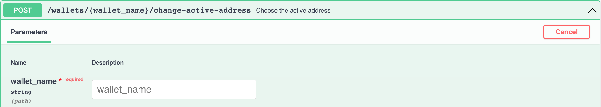

# Hướng dẫn đào Solo 

Đầu tiên bạn phải làm theo các bước ở [Hướng dẫn bắt đầu Full node](full-node/getting-started.md) để tải về, khởi chạy node của bạn và sử dụng Swagger [http://127.0.0.1:12973/docs](http://127.0.0.1:12973/docs).

## Thông tin về việc đào 

- có 4 địa chỉ với 4 group và 16 chain tổng cộng
- dự tính block time là 64 giây
- mỗi ngày có trung bình `24 * 60 * 60 / 64 * 16 = 21600` block được đào
- block reward đang là 3 ALPH ở thời điểm hiện tại 
- Tất cả các coin được đào sẽ bị khoá trong 500 phút 

Để biết thêm thông tin về mining reward, hãy đọc qua [Block Rewards](https://medium.com/@alephium/alephium-block-rewards-72d9fb9fde33).

Bạn có thể biết được hashrate được ước tính từ nhật ký full node của bạn, hoặc từ bảng điều khiển Grafana của full node nếu bạn chạy nó bằng [docker-compose](full-node/docker-guide.md).

## Miner wallet

Đầu tiên, bạn phải tạo một ví chuyên dụng cho việc đào. Trái ngược với _ví thông thường_, một _ví dành cho người đào_ có nhiều địa chỉ được sử dụng để thu thập các mining reward cho mỗi group địa chỉ.

#### Tạo miner wallet

Server sẽ gửi cho bạn một cụm từ mnemonic của ví với tạo, hãy sao lưu và lưu trữ nó an toàn. 

#### Liệt kê các địa chỉ ví đào

Server sẽ gửi bạn 4 địa chỉ ví cho bước tiếp theo:

## Thiết lập miner addresses

Hiện tại bạn đã có 4 địa chỉ ví dành-cho-người-đào, bạn phải gán chúng cho node của bạn để có được reward khi nó bắt đầu đào. Việc này có thể được thực hiện bằng cách thêm vào nội dung sau đây `.alephium/user.conf` trong home folder của bạn [^1]:

    alephium.network.external-address = "x.x.x.x:9973" // put your public IP here; otherwise remove this line
    alephium.mining.miner-addresses = [
      "1HiYeRbypJQK4nc6EFYWiRVdsdYukQKq8SvKQsfJ3wiR8",
      "1HD3q1G7qVoeyNA4U6HbBhFvv1FLUWNGwNavPamScpVLa",
      "1CQiD2RQ58ymszcgPEszRomyMZxEjH1Rtp4tB84JY2qgL",
      "19vvD3QbfEYbJexk6yCtnDNpRrfr3xQv2Pzc6x265MRhD"
    ]

Vui lòng khởi động lại node của bạn để các cấu hình mới này có hiệu lực. Hãy đảm bảo rằng bạn thêm chúng vào theo đúng thứ tự mà nó đã hiện ra, vì chúng được sắp xếp theo các group theo trình tự.

## Bảo mật

Theo mặc định, giao diện API của Alephium sẽ khởi chạy trên localhost, API endpoint của bạn được bảo mật. Tuy nhiên, nếu bạn tuỳ chỉnh `alephium.api.network-interface`, endpoint của bạn có thể bị lộ trên public network. Nó rất. nguy hiểm bởi ai đó có thể truy cập vào miner wallet của bạn. Hãy cân nhắc thiết lập API Key theo hướng dẫn sau: [API Key](full-node/full-node-more.md#api-key).

Vui lòng hãy tạo một ví khác để đảm bảo an toàn và di chuyển tài sản của bạn vào nó bằng `sweep-all-addresses` endpoint một cách thường xuyên.

## Bắt đầu khai thác

### Hãy chắc chắn rằng full node của bạn đã được đồng bộ

Bạn có thể kiểm tra nó bằng cách thực thi endpoint này:

Nếu bạn thấy phản hồi là `"synced": true`, lúc này bạn đã sẳn sàn khai thác.

### Nvidia GPU

Xin hãy đọc qua hướng dẫn [https://github.com/alephium/gpu-miner](https://github.com/alephium/gpu-miner#readme) để thiết lập gpu miner cho Nvidia GPU.

Một cách khác, bạn có thể chạy gpu-miner với docker bằng tài liệu này [https://github.com/alephium/alephium/tree/master/docker#gpu-miner-optional](https://github.com/alephium/alephium/tree/master/docker#gpu-miner-optional)

### AMD GPU

Xin hãy đọc qua hướng dẫn [https://github.com/alephium/amd-miner](https://github.com/alephium/amd-miner#readme) ể thiết lập gpu miner cho AMD GPU. Lưu ý AMD miner có thể sẽ không tối ưu bằng Nvidia miner.

Nếu bạn có câu hỏi, hãy đưa câu hỏi của bạn lên developers trên [Discord](https://alephium.org/discord).

## Thông tin thêm về miner wallet

Dưới đây là một số endpoint hữu ích cho bạn.

#### Lấy số dư

#### Thay đổi địa chỉ ví đang hoạt động

#### Di chuyển tài sản từ ví đang hoạt động sang ví khác

#### Mở khoá ví của bạn

#### Khôi phục miner wallet

[^1]: home folder tuỳ thuộc vào hệ thống của bạn: `C:\Users\<your-username>` trên Windows, `/Users/<your-username>` trên macOS, `/home/<your-username>` trên Linux.
